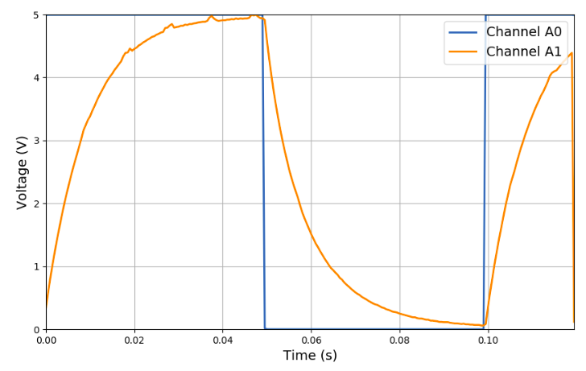

# Arduscopio

Arduscopio es una interfaz Arduino-Python desarrollada para la adquisición de datos
analógicos. El comportamiento de la interfaz imita algunas características propias de un
osciloscopio, tales como la funcionalidad de Trigger y el cambio de escala temporal.

Arduscopio surge como una iniciativa para facilitar la adquisición de datos en la materia
Laboratorio 3 del Departamento de Física de la Facultad de Ciencias Exactas y Naturales de
la UBA.



## Instalación

### Python

El paquete puede ser instalado utilizando [PIP](https://pypi.org/project/arduscope):

```
pip install arduscope
```

El paquete instala las siguientes dependencias en caso de no encontrarse presentes:

- numpy
- matplotlib
- pyserial
- tqdm

### Arduino

El código de Arduino puede ser descargado desde el repositorio del proyecto.

[Click derecho en este link -> Guardar como][1]

Debe ser cargado en una placa Arduino UNO (excluyente).
**Ninguna fracción del código fue pensada para ser compatible con otra placa.**
Cualquier funcionamiento del código fuera de Arduino UNO es mera coincidencia.

## Ejemplo de uso

Los elementos centrales del paquete son el objeto `Arduscope` (la interfaz entre Python y
el Arduino)
y el objeto `ArduscopeMeasure` (un contenedor para los resultados adquiridos)

En primer lugar debemos importar estas clases del paquete que instalamos:

```python
from arduscope import Arduscope, ArduscopeMeasure
```

Luego podemos crear una instancia del Arduscopio, indicando el puerto de conexión. Nos
conviene utilizar el contexto `with ... as` para no olvidarnos de cerrar el puerto.

Arduino IDE nos muestra el nombre del puerto en la esquina inferior derecha.

En Windows los puertos suelen llamarse `"COM1"`, `"COM2"`, etc. En Linux el formato suele
ser `"/dev/ttyUSB0"` o parecido.

```python
with Arduscope(port='/dev/ttyUSB0') as arduino:
```

El objeto que instanciamos bajo el nombre arduino (podría ser cualquier otro) tiene una
serie de propiedades y métodos.

La lógica general es que las propiedades se configuren primero y luego se active la
adquisición.

Si el usuario olvida detener la adquisición y cambia una propiedad la adquisición se
detiene y reanuda automáticamente.

```python
  arduino.frequency = 2000  # Frecuencia de adquisición (en Hz)
  arduino.pulse_width = 0.05  # Ancho del pulso digital (en Segundos)
  arduino.trigger_value = 2.5  # Valor del trigger (en Volts)
  arduino.amplitude = 5.0  # Amplitud de la señal (en Volts)
  arduino.n_channels = 2  # Cantidad de canales (1 a 6)
  arduino.trigger_channel = "A0"  # Canal/Modo de trigger (ver apartado)
  arduino.trigger_offset = 0.0  # Offset del trigger (en fracción de pantalla)
```

Para comenzar la adquisición se utiliza el método `start_acquire()`.

La misma puede ser detenida mediante `stop_acquire()`.

Estos métodos no detienen la ejecución principal del programa.

El método `live_plot()` abre un gráfico de Matplotlib y actualiza su contenido para cada
nueva pantalla. Requiere que el modo ventana de Matplotlib se encuentre activo.

Hasta que el gráfico no es cerrado la ejecución principal se detiene, generando un momento
para que el usuario vea los datos en tiempo real y decida si quiere continuar con su
script o detenerlo.

```python
  arduino.start_acquire()
  arduino.live_plot()
```

A continuación podemos trabajar con los datos adquiridos.

En primer lugar conviene asegurar que fueron adquiridas la cantidad de pantallas que
necesitamos. Para eso podemos usar la función `wait_until(n_screens, timeout)`.

Esta función detiene la ejecución principal hasta que el buffer de pantallas
tenga `n_screens` almacenadas. También podemos pasarle un parámetro opcional de `timeout`
para que se produzca un error por tiempo límite (en segundos).

```python
  arduino.wait_until(n_screens=50, timeout=None)
```

Si la cantidad de pantallas ya fue alcanzada al llamar esta función el resultado será
inmediato. También podríamos detener la adquisición para que el buffer deje de
sobreescribirse. Podemos hacerlo explícitamente mediante la función `stop_acquire` o
dejar que el cierre del contexto `with` lo haga automáticamente.

Podemos acceder al las mediciones realizadas mediante la propiedad `measure`.
Esta propiedad nos devuelve un objeto `ArduscopeMeasure`, que es nuestro contenedor de
resultados. 

```python
measure = arduino.measure
```

Este objeto almacena los resultados obtenidos junto con el estado del Arduscopio al
momento de realizar la medición (las mismas propiedades que configuramos antes).
También tiene un vector `x` generado a partir de la frecuencia que corresponde al eje
temporal. 

Los canales quedan almacenados en una lista y podemos recuperarlos mediante la propiedad 
`channels`. El formato para cada canal es `[cantidad de pantallas] x [puntos por pantalla]`.
Podemos ver lo mencionado hasta acá con algunos ejemplos:

```python
# Eje temporal de las mediciones
>> measure.x
# Valor del trigger
>> measure.trigger_value
# Canal A0, pantalla más antigua
>> measure.channels[0][0]
# Canal A2, pantalla más reciente
>> measure.channels[2][-1]
# Canal A2, pantalla más reciente, primeros 50 puntos
>> measure.channels[2][-1][0:50]
# Canal A1, promedio de todas las pantallas
>> measure.channels[1].mean(axis=0)
# Canal A1, desviación estándar de todas las pantallas
>> measure.channels[1].std(axis=0)
# Canal A0, promedio de las últimas 50 pantallas
>> measure.channels[1][-50:].mean(axis=0)
```

Observando esos ejemplos podríamos hacer un gráfico muy simple del siguiente modo:

```python
fig, ax = plt.subplots(1, 1, figsize=(8, 6))
ax.plot(measure.x, measure.channels[0].mean(axis=0), label='a0')
ax.plot(measure.x, measure.channels[1].mean(axis=0), label='a1')
ax.set_title(f"Valor del trigger: {measure.trigger_value}V")
plt.show()
```

Finalmente podríamos querer almacenar una medición en un archivo. El objeto screen provee
un método `save` para facilitar esta tarea. El formato se decide a partir de la extensión
del archivo creado:

```python
measure.save("data.csv")  # Formato CSV (separado por comas)
measure.save("data.npz")  # Formato NPZ (array comprimido de Numpy)
measure.save("data.json")  # Formato JSON (objeto de JavaScript)
```

Para recuperar una pantalla guardada vamos a crear un nuevo objeto `ArduscopeMeasure` del
siguiente modo:

```python
measure = ArduscopeMeasure.load("data.csv")
```

### Ejemplo completo

```python
import matplotlib.pyplot as plt
from arduscope import Arduscope
# from arduscope import ArduscopeMeasure

with Arduscope(port='/dev/ttyUSB0') as arduino:
    arduino.frequency = 1000
    arduino.pulse_width = 0.2
    arduino.trigger_value = 1.0
    arduino.amplitude = 5.0
    arduino.n_channels = 2
    arduino.trigger_channel = "D7OUT_HIGH"
    arduino.trigger_offset = 0.0

    arduino.start_acquire()
    arduino.live_plot()
    arduino.wait_until(n_screens=10, timeout=None)

measure = arduino.measure

ax: plt.Axes
fig, ax = plt.subplots(1, 1, figsize=(8, 6))
ax.plot(measure.x, measure.channels[0].mean(axis=0), label='a0')
ax.plot(measure.x, measure.channels[1].mean(axis=0), label='a1')
ax.set_title(f"Trigger: {measure.trigger_value}V")

plt.show()

measure.save("data.csv")  # Formato CSV (separado por comas)
measure.save("data.npz")  # Formato NPZ (array comprimido de Numpy)
measure.save("data.json")  # Formato JSON (objeto de JavaScript)

# measure = ArduscopeMeasure.load("data.csv")

```

[1]: https://raw.githubusercontent.com/alemazzeo/arduscope/main/arduscope/arduscope.ino